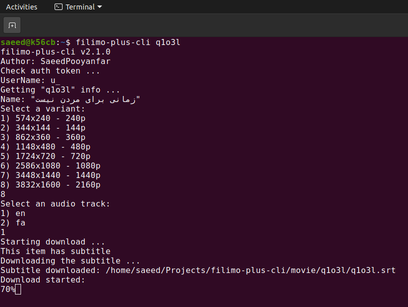

# FilimoPlusCli

### About

With this app you can **download** filimo items!

### Note

You must create account in [filimo](https://www.filimo.com) and buy subscription package to use this app

### Dependencies

+ [Node.js](https://nodejs.org/en)
+ [FFmpeg](https://www.ffmpeg.org)

### Platforms

+ linux
+ win32

### How to run

+ Copy `AuthV1` cookie value from filimo
+ Download latest version from releases section
+ Cd to project directory
+ Run: `npm install`
+ Run: `npm run build:linux` or `npm run build:win32`
+ Run: `npm link`
+ Run: `filimo-plus-cli` or `filimo-plus-cli $ID`
+ Follow steps

### Support

I spent huge amount of time for creating `filimo-plus-cli` 
If you like my work please show your support by clicking on star button and share this repo with your friends 
Also you can send your donations via [this link](https://zarinp.al/@saeedpooyanfar) 😄😍 
Thank you!
